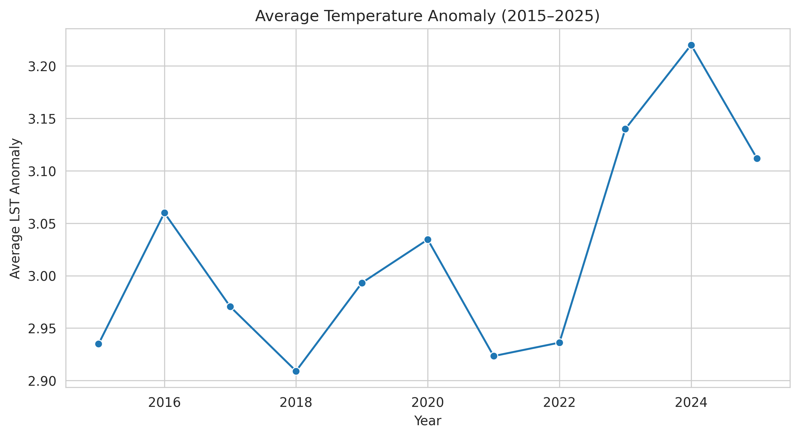
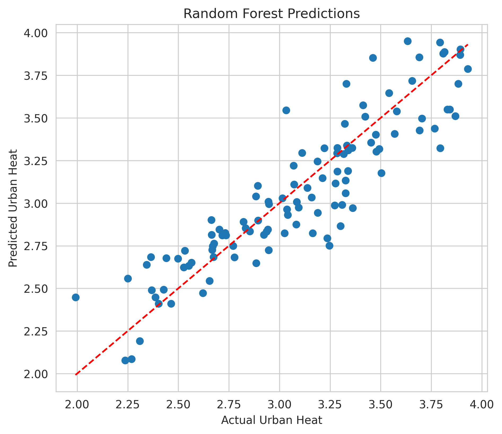

# Global Urban Heat Island Analysis
In this project I have used exploratory data analysis, multiple linear regression, and Random Forest Regression, to examined how urban vegetation, impervious surfaces, and population density relate to land surface temperature anomalies.
# Global Urban Heat Island Analysis (2015–2025)

## Project Overview

Urban Heat Island (UHI) effects have emerged as one of the most pressing environmental challenges accompanying rapid urbanisation. As cities continue to expand, increasing impervious surfaces and declining vegetation contribute to elevated land surface temperatures, affecting public health, energy demand, and urban sustainability.

This project investigates the environmental determinants of urban heat intensity using a global dataset spanning **2015–2025**. Through exploratory data analysis, statistical modelling, and machine learning techniques, the study evaluates how vegetation cover, tree canopy, impervious surfaces, and population density influence land surface temperature anomalies.

---

## Project Objectives

The project seeks to answer the following questions:

- How has urban heat intensity changed between 2015 and 2025?
- What relationship exists between urban vegetation and land surface temperature anomalies?
- Do impervious surfaces significantly contribute to urban heat intensity?
- Which environmental variables are the strongest predictors of Urban Heat Island effects?
- Does a machine learning model outperform traditional linear regression in predicting urban heat?

---

## Dataset

**Source:** Kaggle

The dataset contains environmental and urban indicators for multiple cities between **2015 and 2025**.

### Key Variables

- Land Surface Temperature Anomaly (°C)
- NDVI (Normalized Difference Vegetation Index)
- Tree Canopy Percentage
- Impervious Surface Percentage
- Population Density
- Heat-related Mortality
- Climate Zone
- Year

---

## Methodology

The analysis follows a structured workflow:

### Data Preparation

- Data loading and inspection
- Missing value assessment
- Duplicate record detection
- Descriptive statistics

### Exploratory Data Analysis (EDA)

- Distribution of variables
- Correlation matrix
- Urban heat trends over time
- Scatterplots examining relationships between environmental variables and urban heat
- Climate zone comparisons

### Statistical Analysis

- Multiple Linear Regression
- Variance Inflation Factor (VIF) for multicollinearity assessment

### Machine Learning

- Random Forest Regression
- Feature Importance Analysis
- Model Performance Evaluation

---

## Technologies Used

- Python
- Pandas
- NumPy
- Matplotlib
- Seaborn
- Statsmodels
- Scikit-learn
- Kaggle Notebook

---

## Key Findings

- Urban vegetation exhibits a negative association with land surface temperature anomalies, suggesting that greener cities experience lower urban heat intensity.

- Impervious surface coverage is positively associated with urban heat, reinforcing the role of built-up environments in intensifying Urban Heat Island effects.

- NDVI and Tree Canopy Percentage demonstrated high multicollinearity, reflecting that both variables capture closely related aspects of urban vegetation.

- Random Forest Regression substantially outperformed Multiple Linear Regression, achieving an **R² of 0.809** and an **RMSE of 0.201°C**, indicating that urban heat dynamics are influenced by complex, non-linear relationships.
- ## Correlation Matrix



## Urban Heat Trend


## Random Forest 




---

## Model Comparison

| Model | Purpose |
|--------|---------|
| Multiple Linear Regression | Estimates the linear relationship between environmental variables and urban heat while providing interpretable coefficients and significance tests. |
| Random Forest Regression | Captures complex, non-linear relationships and identifies the relative importance of predictor variables. |

The Random Forest model achieved superior predictive performance, suggesting that machine learning approaches can complement traditional statistical methods in environmental modelling.

---

## Policy Implications

The findings highlight the importance of integrating green infrastructure into urban planning strategies. Increasing vegetation cover and preserving tree canopy can contribute to mitigating Urban Heat Island effects, while limiting excessive impervious surface expansion may improve urban climate resilience.

The results also demonstrate the value of combining statistical modelling with machine learning techniques to support evidence-based environmental planning and sustainable urban development.

---

## Repository Contents

```
Global-Urban-Heat-Island-Analysis/
│
├── README.md
├── analysing-urban-heat-island-components.ipynb
└── images/
```

---

## Future Improvements

Potential extensions of this project include:

- Spatial analysis using GIS
- Incorporating satellite imagery
- Hyperparameter optimisation of Random Forest models
- Comparison with Gradient Boosting and XGBoost
- Time-series forecasting of urban heat intensity

---

## Author

**Srishti Kandari**

Development Economics | Urban Analytics | Migration & Climate Research

GitHub: https://github.com/srishtikandari

LinkedIn: *(https://www.linkedin.com/in/srishti-kandari/)*

